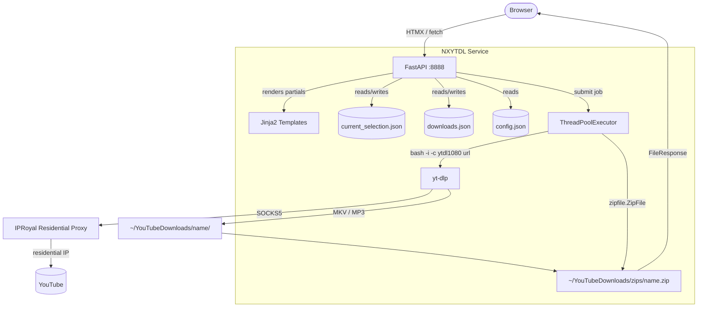

# NXYTDL — Documentation

> **N**o-fuss **Y**ouTube **D**ownloader with a dark-theme web UI, real-time progress, proxy support, and zip packaging.

---

## Table of Contents

1. [Architecture Overview](#1-architecture-overview)
2. [System Components](#2-system-components)
3. [How It Works](#3-how-it-works)
4. [Proxy & Cookie Authentication](#4-proxy--cookie-authentication)
5. [Alias Configuration](#5-alias-configuration)
6. [Running & Managing the Server](#6-running--managing-the-server)
7. [API Reference](#7-api-reference)
8. [Troubleshooting](#8-troubleshooting)
9. [Future Enhancement Ideas](#9-future-enhancement-ideas)

---

## 1. Architecture Overview



**Key design principle:** The server is a thin orchestrator. Heavy work (yt-dlp, zipping) runs in a `ThreadPoolExecutor`, never blocking the async event loop.

---

## 2. System Components

| Component | Role |
|-----------|------|
| `main.py` | Single-file FastAPI application — all routes, helpers, and state |
| `templates/index.html` | Full-page shell: nav, search, manual add, section placeholders |
| `templates/partials/` | Five HTMX partials swapped in-place for every mutation |
| `data/config.json` | Runtime configuration: proxy URL, Firefox profile path |
| `data/current_selection.json` | Active download queue, persists across restarts |
| `data/downloads.json` | History of completed zip archives |
| `start.sh` / `stop.sh` | Background process management with PID tracking |
| `setup.sh` | One-command installer: prereqs, config, aliases, start |
| `~/.nxytdl_aliases` | Bash alias definitions (sourced by `~/.bashrc`) |
| `~/YouTubeDownloads/` | All downloaded media, organised by list name |
| `~/YouTubeDownloads/zips/` | Packaged zip archives served for download |

---

## 3. How It Works

### 3.1 Search → Selection

1. User types a query; HTMX `POST /search` fires.
2. Server shells out to `yt-dlp "ytsearch15:<query>" --dump-json --flat-playlist`.
3. Each JSON line is parsed; the top 15 results are rendered in `search_results.html`.
4. User checks boxes and clicks **Add Selected to List** → `POST /selection/add` with a JSON payload.
5. Server deduplicates by URL and appends to `current_selection.json`.

### 3.2 Manual URL & Playlist Detection

- On blur / Enter, JS checks the URL for a `list=` parameter.
- If found: an inline prompt asks "This video only" or "Add full playlist".
  - *This video only* strips `list=` and `index=` params, then calls `POST /selection/add-url`.
  - *Add full playlist* calls `POST /selection/add-playlist`, which runs `yt-dlp --flat-playlist --print "%(id)s\t%(title)s"` and adds every video.
- `POST /selection/add-url` fetches the video title via `yt-dlp --print title` before adding (so the list shows real names, not raw URLs).

### 3.3 Download Flow

```
POST /download/start
  │
  ├─ Validates list name and item count
  ├─ Snapshots current_selection.json items
  ├─ Creates job dict in memory (jobs[job_id])
  └─ Submits _run_download() to ThreadPoolExecutor → returns {job_id}

JS inserts HTMX polling div:
  GET /download/progress/{job_id}  every 2 s

_run_download() [background thread]:
  for each item:
    ├─ _has_existing_download() — skip if [VIDEO_ID] already in dl_dir
    ├─ bash -i -c "cd /dl_dir && ytdl1080 <url>"  (alias sources ~/.bashrc)
    ├─ Popen with stdout=PIPE, bufsize=1
    ├─ Read lines → job["current_lines"][-5:]  (live terminal feed)
    └─ Update job["last_update"] for stall detection

  After all items:
    ├─ Strip emojis from file names
    ├─ Open zip in append mode ("a") if it exists, else "w"
    ├─ Add only files not already in zip (deduplicate by filename)
    ├─ Write entry to downloads.json
    └─ Clear current_selection.json only if zero errors
```

### 3.4 Real-Time Progress

The progress partial auto-polls via HTMX `hx-trigger="every 2s"`. The partial is replaced with each poll. When `job["status"]` becomes `"done"`, the partial stops polling (no `hx-trigger` on the final render) and injects a `<script>` that calls `refreshDownloads()` and `refreshSelection()`.

**Stall detection:** If `time.time() - job["last_update"] > 20` seconds while status is `"running"`, a yellow warning banner appears. This catches silent yt-dlp hangs without killing the process.

### 3.5 Zip Append Mode

If `~/YouTubeDownloads/zips/name.zip` already exists (from a prior download of the same list name), it is opened in `"a"` (append) mode. Only files whose basename does not already appear in the zip's namelist are added. This means:

- Re-downloading a partial list just adds the new files — it never overwrites.
- The zip grows monotonically; no data is lost.

### 3.6 Emoji Stripping

`_strip_emojis()` is applied to:
- Search result titles (before display)
- yt-dlp title lookups for manual URL adds
- Playlist video titles
- Downloaded file names before zipping

It is **not** applied to URLs (emoji can appear in URLs and stripping breaks them).

---

## 4. Proxy & Cookie Authentication

### Why a Proxy?

YouTube aggressively blocks datacenter IPs (AWS, VPS, etc.). A **residential proxy** routes traffic through real home internet connections, making requests indistinguishable from organic browser traffic. NXYTDL uses IPRoyal's SOCKS5 residential proxy.

### Proxy URL Format

```
socks5://<username>:<password>@<hostname>:<port>
```

Stored in `data/config.json` as `"proxy_url"`. Read once at module import — restart the server after changing it.

### Why Firefox Cookies?

YouTube increasingly serves different content to logged-in vs. anonymous users, and uses cookie fingerprinting to detect bots. By passing `--cookies-from-browser firefox:<profile_path>`, yt-dlp reads your actual Firefox session cookies, presenting a fully authenticated session to YouTube.

This is required for:
- Age-restricted videos
- Member-only content
- Avoiding the "Sign in to confirm you're not a bot" challenge

### Cookie Profile Path (WSL)

On Windows with WSL2, Firefox's profile lives inside the Windows filesystem:

```
/mnt/c/Users/<WindowsUsername>/AppData/Local/Packages/Mozilla.Firefox_n80bbvh6b1yt2/LocalCache/Roaming/Mozilla/Firefox/Profiles/<profile_id>.default-release
```

`setup.sh` auto-detects this path. If Firefox is the traditional (non-Store) install:

```
/mnt/c/Users/<WindowsUsername>/AppData/Roaming/Mozilla/Firefox/Profiles/<profile_id>.default-release
```

---

## 5. Alias Configuration

Aliases are stored in `~/.nxytdl_aliases` and sourced from `~/.bashrc`. They encapsulate all yt-dlp flags so the application only needs to call the alias by name.

### Full Flag Breakdown

| Flag | Purpose |
|------|---------|
| `--proxy "socks5://..."` | Route traffic through IPRoyal residential proxy |
| `--extractor-args "youtube:player_client=web,web_safari,web_embedded,android_vr"` | Try multiple YouTube player clients to bypass bot detection |
| `--cookies-from-browser "firefox:<path>"` | Use real Firefox session cookies |
| `--js-runtimes deno` | Use Deno for JavaScript execution (required by some extractors) |
| `--remote-components ejs:github` | Download latest JavaScript extractor components from GitHub |
| `--sleep-interval 5 --max-sleep-interval 12` | Random 5–12 s pause between downloads (avoids rate limits) |
| `--concurrent-fragments 8` | Download 8 video fragments in parallel (faster on good connections) |
| `--merge-output-format mkv` | Merge video+audio into MKV (avoids lossy re-encoding) |
| `-f "bestvideo[height<=1080]+bestaudio/best"` | Select best video up to 1080p + best audio |

### Alias → Quality Mapping in main.py

```python
def _alias(quality: str) -> str:
    return {"720": "ytdl720", "mp3": "ytdlmp3"}.get(quality, "ytdl1080")
```

The default (anything not `720` or `mp3`) maps to `ytdl1080`.

### Adding a New Quality

1. Add the alias to `~/.nxytdl_aliases` (or re-run `setup.sh` and extend it).
2. Add the mapping key to `_alias()` in `main.py`.
3. Add an `<option>` in `templates/partials/selection_table.html`.
4. Restart the server.

---

## 6. Running & Managing the Server

### Starting

```bash
./start.sh
```

- Runs `uvicorn main:app --host 0.0.0.0 --port 8888` in the background (no `--reload`).
- Saves PID to `.uvicorn.pid`; appends logs to `uvicorn.log`.
- If port 8888 is already in use, prompts to stop the existing process.

### Stopping

```bash
./stop.sh
```

- Sends SIGTERM, waits up to 5 s for graceful shutdown.
- Escalates to SIGKILL if needed.
- Auto-escalates to `sudo kill` if permission is denied.

### After Changing Code

```bash
./stop.sh && ./start.sh
```

There is no `--reload`. New routes are invisible until restart. If you see `405 Method Not Allowed` on a new endpoint, you forgot to restart.

### Viewing Logs

```bash
tail -f uvicorn.log
# or open http://localhost:8888/log in a browser tab
```

### Accessing the UI

| From | URL |
|------|-----|
| Same machine | `http://localhost:8888` |
| Local network | `http://<server-ip>:8888` |

---

## 7. API Reference

| Method | Path | Description |
|--------|------|-------------|
| `GET` | `/` | Full page |
| `GET` | `/log` | `uvicorn.log` as plain text |
| `POST` | `/search` | yt-dlp search → `search_results.html` partial |
| `GET` | `/selection` | Current selection partial |
| `POST` | `/selection/add` | Add items from search results (JSON array in form field) |
| `POST` | `/selection/add-url` | Add single URL; title fetched via yt-dlp |
| `POST` | `/selection/add-playlist` | Enumerate full playlist and add all videos |
| `DELETE` | `/selection/{item_id}` | Remove one item by UUID |
| `POST` | `/download/start` | Start background download; returns `{job_id}` |
| `GET` | `/download/progress/{job_id}` | Poll job status (HTMX partial, self-polling) |
| `POST` | `/download/zip-existing` | Zip files already on disk without re-downloading |
| `GET` | `/downloads` | Previous downloads partial |
| `GET` | `/downloads/{zip}/file` | Serve zip as attachment |
| `DELETE` | `/downloads/{zip}` | Delete zip + extracted folder |
| `GET` | `/files` | Recursive file browser partial |
| `GET` | `/files/download?p=` | Serve file as attachment |
| `GET` | `/files/play?p=` | Serve file inline (browser plays it) |
| `DELETE` | `/files/single?p=` | Delete one file |
| `DELETE` | `/files/folder?p=` | Delete entire folder |
| `DELETE` | `/files/all` | Wipe all of ~/YouTubeDownloads |

All mutating endpoints return rendered HTML partials, not JSON (HTMX pattern).

---

## 8. Troubleshooting

### 405 Method Not Allowed on a new endpoint
You forgot to restart after adding the route. Run `./stop.sh && ./start.sh`.

### Download stalls (yellow warning in UI)
yt-dlp stopped producing output. Common causes:
- YouTube returned a bot challenge → check Firefox cookies are current (open YouTube in Firefox first)
- Proxy connection dropped → check IPRoyal dashboard for quota/status
- `--remote-components ejs:github` is downloading a large file → wait longer, or remove that flag temporarily

Check `uvicorn.log` for the raw yt-dlp stderr.

### "No results" in search
- Proxy may be blocked. Try a fresh proxy session or rotate the IP.
- yt-dlp may be out of date: `pip install -U yt-dlp`

### Alias not found when download runs
`bash -i` sources `~/.bashrc`, which sources `~/.nxytdl_aliases`. If the alias is missing:
- Confirm `~/.nxytdl_aliases` exists and contains the alias.
- Confirm `~/.bashrc` contains `source ~/.nxytdl_aliases`.
- Re-run `bash setup.sh` to reinstall.

### "UndefinedError" in template
A variable used in an included partial is missing from the parent route's context. Always use `**_selection_ctx(sel)` in the index route and any route that returns the selection partial.

### Permission denied stopping the server
`stop.sh` auto-escalates to `sudo kill`. If `sudo` requires a password, you'll be prompted.

### Zip is missing some files
Files with `.part` extension are excluded (incomplete downloads). If a download was interrupted, re-run it — `_has_existing_download()` will skip already-complete files and only fetch missing ones.

### Firefox cookie path not working on WSL
The path must be the **Windows** filesystem path via `/mnt/c/`, not a Linux Firefox path. Open Firefox on Windows, navigate to `about:profiles`, find the "Root Directory" value, and translate it to the `/mnt/c/` equivalent.

---

## 9. Future Enhancement Ideas

### Near-term
- **Download queue persistence** — jobs dict is in-memory; a server restart loses in-progress job state. Persist to `data/jobs.json`.
- **Subtitle download option** — add `--write-subs --sub-langs en` as a quality option.
- **Thumbnail embedding** — `--embed-thumbnail` for MP3s.
- **Speed limit setting** — `--limit-rate 5M` UI toggle for bandwidth-constrained environments.
- **Dark/light theme toggle** — currently hardcoded dark navy.

### Medium-term
- **Scheduled downloads** — cron-like scheduling ("download this playlist every Monday").
- **Multiple proxy profiles** — switch between proxy providers without re-running setup.
- **Download history search** — filter the Previous Downloads table by name/date.
- **Mobile-optimised layout** — the current UI is readable but not touch-first.

### Longer-term
- **Multi-user support** — per-user selection lists and download history.
- **yt-dlp plugin support** — expose `--use-postprocessor` and custom post-processing chains.
- **Streaming to Plex/Jellyfin** — write directly to a media server's watched directory.
- **Telegram/Discord bot frontend** — send URLs via chat, receive download completion notifications.
- **Browser extension** — one-click "Send to NXYTDL" from any YouTube page.
